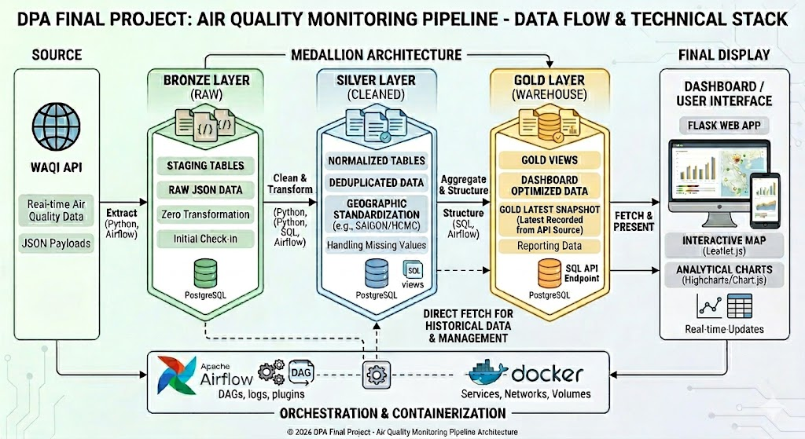
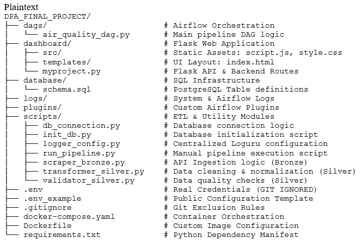

🌍 Air Quality Monitoring Pipeline (DPA Final Project):
An End-to-End Data Engineering Pipeline.
Combining Python Project PY4E03 and DPA ETL PIPELINE. This project implements a Medallion Architecture to transform raw WAQI API data into high-performance insights for air quality monitoring.

🏗️ 1. Project Architecture & Data Flow:

The system processes data through three distinct stages to ensure high data integrity, orchestrated by Apache Airflow within a Dockerized environment.

* Bronze Layer: Raw data ingestion from the WAQI API via scraper_bronze.py.

* Silver Layer: Cleaned and normalized data (standardizing city names like Saigon) stored in PostgreSQL.

* Gold Layer: Optimized snapshots (gold_latest_snapshot) for real-time dashboard visualization.

<strong>Figure 1: Medallion Architecture Data Flow (WAQI API to Dashboard)</strong>

🛠️ 2. Tech Stack:

This project leverages a modern data engineering stack to handle automation, storage, and visualization:

    * Orchestration: Apache Airflow.

    * Backend: Flask (Python) with SQLAlchemy & Psycopg2.

    * Frontend: HTML5, Tailwind CSS, JavaScript (Highcharts, Chart.js, Leaflet.js).

    * Database: PostgreSQL (Relational Data Warehouse).

    * Infrastructure: Docker & Docker Compose.    

🚀 3. Installation & Setup

Phase A: Environment Configuration

    1.	Clone the Repository to your local machine.
    2.	Create a .env file in the root directory. You can use the provided .env_example as a template.
    3.	Add your WAQI API Token (available at aqicn.org) to the WAQI_API_TOKEN variable.

Phase B: Deployment (Choose One Path)

Option 1: Docker Deployment (Recommended)
    1.	Set DB Host: Ensure DB_HOST=postgres_dw in your .env. 
    2.	Initialize Airflow:

        Bash
        docker-compose up airflow-init

    3.	Launch Services:

        Bash
        docker-compose up -d

    4.	Access Points:
    o	Dashboard: http://localhost:8000
    o	Airflow UI: http://localhost:8081 (Login: airflow / airflow)

Option 2: Local Windows Development (Manual)
    1.	Set DB Host: Ensure DB_HOST=localhost in your .env. 
    2.	Setup Virtual Environment:

        Bash
        python -m venv venv
        .\venv\Scripts\activate
        pip install -r requirements.txt

    3.	Initialize Database & Run:
    
        Bash
        python scripts/init_db.py
        python dashboard/myproject.py
    ________________________________________

📁 4. Project Structure:
This documentation reflects the exact organization of the repository:

Plaintext

<strong>Figure 2: Project Folder Structure</strong>

📊 5. Key Features
    •	Full ETL Automation: Automated flow from API scraping to Silver-layer validation orchestrated by Airflow.
    •	Medallion CRUD: Ability to Update and Delete records in the Silver-layer directly via the "Data Management" table.
    •	Geospatial Mapping: Interactive Leaflet.js map with color-coded markers for global city AQI levels.
    •	Professional Logging: Centralized logger_config.py tracking all pipeline events in the /logs directory. 
________________________________________

*****************************************************************************************
Developed by Son Nguyen - Final Project for Data Engineering Course (PY4E03 & TC_DPA02)
*****************************************************************************************
